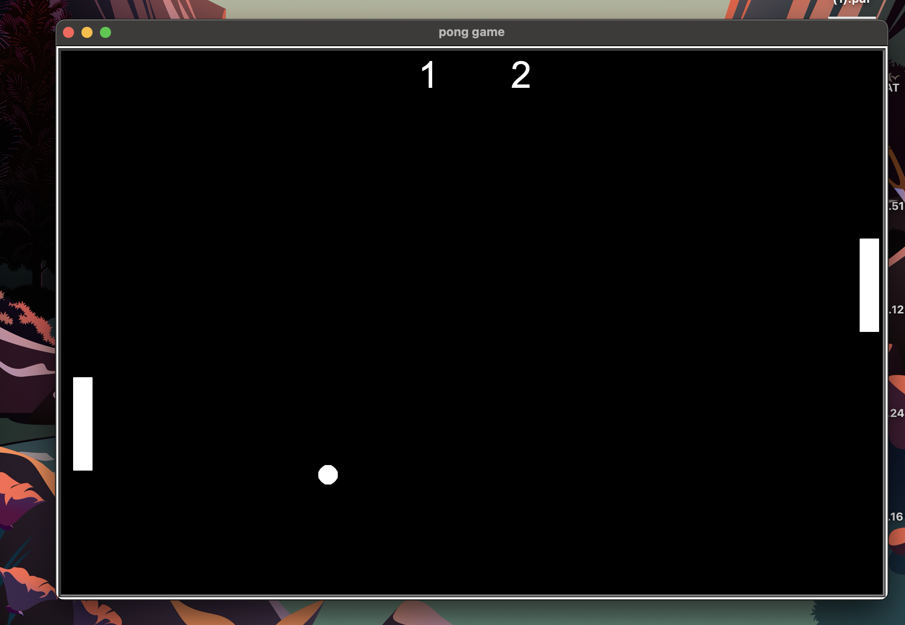

# 🏓 PONG GAME with Python

A fun little game made while practicing Object-Oriented Programming (OOP).

## 📦 Modules Used

- `turtle` (built-in Python graphics module)
- `time` (for delays and game loop timing)

## 🎮 Controls

**Right Paddle:**
- Move Up: `Arrow Up`
- Move Down: `Arrow Down`

**Left Paddle:**
- Move Up: `W`
- Move Down: `S`

## ✅ Requirements

- Python 3.x
- No external libraries needed (only built-in modules)

## 🚀 How to Run

1. Clone or download this repository.
2. Open a terminal or command prompt in the project directory.
3. Run the following command:

```bash
python main.py


